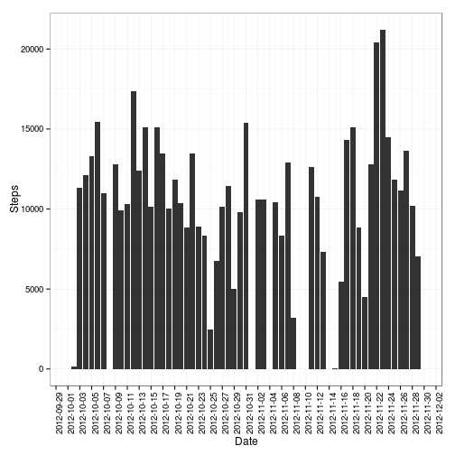
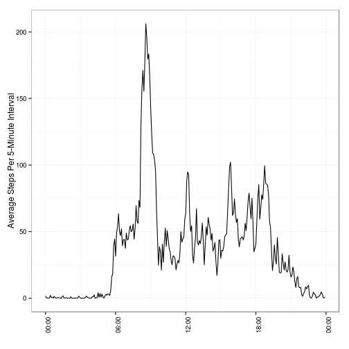
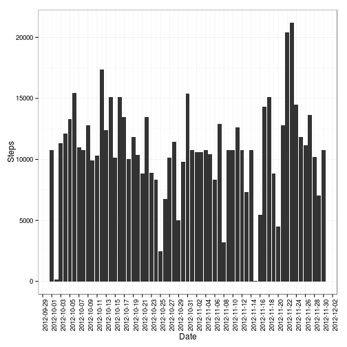
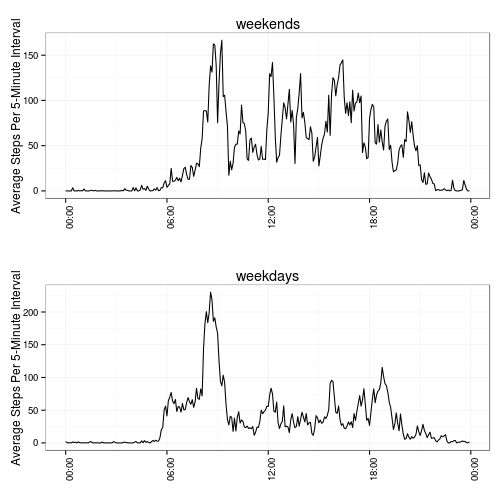

Reproducible Research: Peer Assessment 1
=============================================

First download and extract the data file from the location specified 

Let's load the libraries, read data, and convert date column to class date
 

```r
library(ggplot2)
source("multiplot.R")
d <- read.csv("activity.csv")
d$date <- as.Date(d$date, format = "%Y-%m-%d")
```


There are multiple step records per day (steps data recorded every 5 minutes). 


```r
head(d)
```

```
##   steps       date interval
## 1    NA 2012-10-01        0
## 2    NA 2012-10-01        5
## 3    NA 2012-10-01       10
## 4    NA 2012-10-01       15
## 5    NA 2012-10-01       20
## 6    NA 2012-10-01       25
```


Let's group and sum step counts by day


```r
stepsPerDay <- aggregate(d$steps, list(d$date), sum, na.rm = T)
colnames(stepsPerDay) <- c("date", "steps")
```


Calculate mean and median of total number of steps taken per day


```r
meanStepsPerDay <- mean(stepsPerDay$steps, na.rm = T)
medianStepsPerDay <- median(stepsPerDay$steps, na.rm = T)
```


The mean total number of steps taken per day is 9354.2295, the median is 10395.

Let's look at the histogram of the total number of steps taken each day:


```r
ggplot(stepsPerDay, aes(x = date, y = steps)) + geom_bar(stat = "identity") + 
    scale_x_date(breaks = "2 days", labels = date_format("%Y-%m-%d"), limits = c(as.Date("2012-10-01"), 
        as.Date("2012-11-30"))) + ylab("Steps") + xlab("Date") + theme_bw() + 
    theme(axis.text.x = element_text(angle = 90))
```

 


Let's analyze what is the average daily activity pattern.
We'll start by aggregating data by 5-minute intervals.


```r
averageStepsPerInterval <- aggregate(d$steps, list(d$interval), mean, na.rm = T)
colnames(averageStepsPerInterval) <- c("interval", "steps")
```


Let's plot the time-series of average number of steps taken averaged across all days.


```r
averageStepsPerInterval$time_interval <- strptime(sprintf("%04d", averageStepsPerInterval$interval), 
    "%H%M")
ggplot(averageStepsPerInterval, aes(x = time_interval, y = steps)) + geom_line() + 
    ylab("Average Steps Per 5-Minute Interval") + xlab("Time of day") + scale_x_datetime("", 
    labels = date_format("%H:%M")) + theme_bw() + theme(axis.text.x = element_text(angle = 90))
```

 


Let's find 5-minute interval that, on average across all the days in the dataset, contains the maximum number of steps.


```r
maxStepsInterval <- format(averageStepsPerInterval[averageStepsPerInterval$steps == 
    max(averageStepsPerInterval$steps), ]$time_interval, "%H:%M")
```


And the answer is 08:35.


Now is the time to deal with missing values in the dataset.

Let's start by calculating the total number of missing values in the dataset (i.e. the total number of rows with NAs)


```r
missing <- sum(!complete.cases(d))
percentMissing <- sprintf("%2.0f", 100 * missing/nrow(d))
```


So we have 2304 rows with NAs or about 13% of the data.

Let's use mean value of steps for the given 5 minute interval across all daysa to impute missing values for that 5 minute interval. We'll define a new dataset that is equal to the original dataset but with the missing data filled in.


```r
di <- merge(d, averageStepsPerInterval, by.x = "interval", by.y = "interval")
di[is.na(di$steps.x), ]$steps.x <- di[is.na(di$steps.x), ]$steps.y
di <- di[, 1:3]
colnames(di) <- c("interval", "steps", "date")
```


Calculate mean and median of total number of steps taken per day for new dataset


```r
diStepsPerDay <- aggregate(di$steps, list(di$date), sum, na.rm = T)
colnames(diStepsPerDay) <- c("date", "steps")
meanStepsPerDay <- mean(diStepsPerDay$steps, na.rm = T)
medianStepsPerDay <- median(diStepsPerDay$steps, na.rm = T)
```


The mean total number of steps taken per day is now  10766, the median is  10766.

Let's look at the histogram of the total number of steps taken each day:


```r
ggplot(diStepsPerDay, aes(x = date, y = steps)) + geom_bar(stat = "identity") + 
    scale_x_date(breaks = "2 days", labels = date_format("%Y-%m-%d"), limits = c(as.Date("2012-10-01"), 
        as.Date("2012-11-30"))) + ylab("Steps") + xlab("Date") + theme_bw() + 
    theme(axis.text.x = element_text(angle = 90))
```

 


Now let's compare activity patterns on weekdays and the weekends.

We'll start by creating a new variable in the dataset indicating whether a given date is a weekday or weekend day.


```r
di$weekend <- weekdays(di$date) %in% c("Sunday", "Saturday")
```


Let's make a panel plot containing a time series plot (i.e. type = "l") of the 5-minute interval (x-axis) and the average number of steps taken, averaged across all weekday days or weekend days (y-axis). 


```r
averageStepsPerIntervalWeekend <- aggregate(di[di$weekend, ]$steps, list(di[di$weekend, 
    ]$interval), mean, na.rm = T)
colnames(averageStepsPerIntervalWeekend) <- c("interval", "steps")
averageStepsPerIntervalWeekend$time_interval <- strptime(sprintf("%04d", averageStepsPerIntervalWeekend$interval), 
    "%H%M")

averageStepsPerIntervalWeekdays <- aggregate(di[!di$weekend, ]$steps, list(di[!di$weekend, 
    ]$interval), mean, na.rm = T)
colnames(averageStepsPerIntervalWeekdays) <- c("interval", "steps")
averageStepsPerIntervalWeekdays$time_interval <- strptime(sprintf("%04d", averageStepsPerIntervalWeekdays$interval), 
    "%H%M")

g1 <- ggplot(averageStepsPerIntervalWeekend, aes(x = time_interval, y = steps)) + 
    geom_line() + ggtitle("weekends") + ylab("Average Steps Per 5-Minute Interval") + 
    xlab("Time of day") + scale_x_datetime("", labels = date_format("%H:%M")) + 
    theme_bw() + theme(axis.text.x = element_text(angle = 90))
g2 <- ggplot(averageStepsPerIntervalWeekdays, aes(x = time_interval, y = steps)) + 
    geom_line() + ggtitle("weekdays") + ylab("Average Steps Per 5-Minute Interval") + 
    xlab("Time of day") + scale_x_datetime("", labels = date_format("%H:%M")) + 
    theme_bw() + theme(axis.text.x = element_text(angle = 90))
multiplot(g1, g2)
```

 

